# 🎼 AI Symphony
> **Turn Ideas into Pull Requests with a Crew of Autonomous AI Agents**


**AI Symphony** is an advanced agentic framework that orchestrates a team of specialized AI agents to autonomously plan, code, and review software features. Simply provide a high-level idea, and watch as the symphony conducts a perfect performance, resulting in a production-ready GitHub Pull Request.

---

## 🚀 How It Works

AI Symphony employs a **sequential agentic workflow** where each agent passes their output to the next, ensuring high-quality, verified code.

```mermaid
graph LR
    User[👤 User Idea] --> PM[👩‍💼 Product Manager]
    PM -->|Technical Spec| Dev[👨‍💻 Developer]
    Dev -->|Source Code| Rev[🕵️ Code Reviewer]
    Rev -->|Pull Request| GitHub[🐙 GitHub]
    
    style PM fill:#ff9f43,stroke:#333,stroke-width:2px
    style Dev fill:#54a0ff,stroke:#333,stroke-width:2px
    style Rev fill:#5f27cd,stroke:#333,stroke-width:2px
```



### The Crew
1.  **👩‍💼 Product Manager**: Analyzes your idea and drafts a detailed, step-by-step technical specification.
2.  **👨‍💻 Full-Stack Developer**: Writes clean, efficient code based *strictly* on the spec, handling file creation and logic implementation.
3.  **🕵️ Senior Code Reviewer**: Validates the implementation against the spec, runs checks, and submits a professional Pull Request.

---

## ✨ Key Features

*   **🤖 Autonomous Workflow**: From idea to PR with zero human intervention in the middle.
*   **🛡️ Isolated Workspaces**: Agents work in temporary, sandboxed Git environments to ensure safety.
*   **🔧 Tool-Equipped Agents**: Agents have real access to file systems, Git commands, and GitHub APIs.
*   **🧠 Advanced LLM Support**: Optimized for **Claude 3.5 Sonnet** (via OpenRouter) for superior coding and reasoning capabilities.
*   **📝 Self-Correcting**: The Reviewer agent acts as a quality gate, ensuring code meets standards before PR creation.

---

## ⚡ Quick Start

### Prerequisites
*   Python 3.10+
*   `uv` (recommended) or `pip`
*   GitHub Personal Access Token (PAT)
*   OpenRouter API Key

### Installation

1.  **Clone the repository**
    ```bash
    git clone https://github.com/traali/AI-Symphony.git
    cd AI-Symphony
    ```

2.  **Set up environment**
    ```bash
    cp .env.example .env
    # Edit .env with your API keys and Repo URL
    ```

3.  **Install dependencies**
    ```bash
    uv sync
    # OR
    pip install -r requirements.txt
    ```

### Usage

Conduct the symphony with a single command:

```bash
uv run python src/main.py "Create a landing page with a dark mode toggle"
```

*Sit back and relax. In a few minutes, check your GitHub repository for a new Pull Request!*

---

## 🏗️ Architecture

AI Symphony is built on a robust, modular architecture designed for reliability and scalability.

*   **Orchestration Engine**: Powered by `crewai`, managing agent lifecycle, task delegation, and context sharing.
*   **Workspace Manager**: A custom context manager that handles ephemeral Git cloning, file operations, and cleanup.
*   **Tool Abstraction**: Custom `BaseTool` implementations for `FileRead`, `CodeWrite`, and `GitHubPR` operations.
*   **Configuration**: Centralized agent definitions in `src/config/agents.yaml` allow for easy tuning of prompts and models.

---

## 🤝 Contributing

We welcome contributions! Please see `CONTRIBUTING.md` for details on how to join the orchestra.

1.  Fork the Project
2.  Create your Feature Branch (`git checkout -b feature/AmazingFeature`)
3.  Commit your Changes (`git commit -m 'Add some AmazingFeature'`)
4.  Push to the Branch (`git push origin feature/AmazingFeature`)
5.  Open a Pull Request

---

<div align="center">
  <b>Built with ❤️ by the AI Symphony Team</b>
</div>
