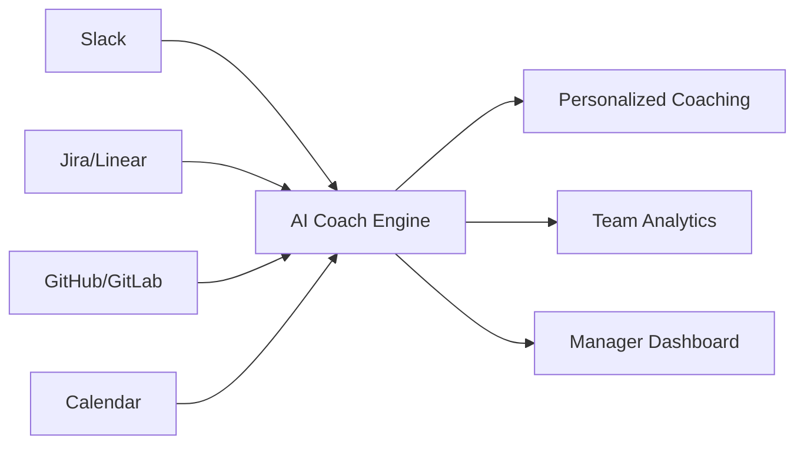

# 🎼 AI Symphony: Business Sparring Session

> **Generated by AI Symphony Business Mode**  
> *Prompt: "Subscription-based AI coach for teams"*

---

## 📋 Executive Summary

**Concept**: A B2B SaaS platform that provides AI-powered coaching for teams, focusing on productivity, collaboration, and skill development through personalized, data-driven insights.

**Target Market**: Mid-sized tech companies (50-500 employees) with distributed teams seeking to improve performance without hiring expensive human coaches.

**Revenue Model**: Tiered subscription ($29/user/mo for Basic, $79/user/mo for Pro, custom Enterprise pricing)

**Competitive Edge**: Unlike generic AI assistants, this platform integrates with team tools (Slack, Jira, GitHub) to provide contextual, actionable coaching based on real work patterns.

---

## 🎯 Problem Statement

1. **Coaching is expensive**: Executive coaches cost $300-500/hour, making them inaccessible for most team members
2. **Generic advice fails**: Self-help content doesn't account for team dynamics or individual work contexts
3. **Managers lack bandwidth**: Team leads want to develop their people but are overwhelmed with their own workload
4. **Remote work isolation**: Distributed teams miss the organic mentorship that happens in physical offices

---

## 💡 Proposed Solution

### Core Features

| Feature | Description | User Value |
|---------|-------------|------------|
| **Daily Pulse** | 2-minute voice/text check-in | Track mood, blockers, wins |
| **Smart Nudges** | Context-aware productivity tips | Right advice at the right time |
| **1:1 Prep** | Auto-generated talking points for manager meetings | More effective conversations |
| **Skill Sprints** | Personalized 2-week micro-learning paths | Continuous growth |
| **Team Insights** | Anonymous team health dashboard | Early warning for burnout |

### Integration Ecosystem

---

## 📊 Market Analysis

### Total Addressable Market (TAM)
- Global corporate training market: **$370B** (2024)
- AI in HR/coaching segment: **$12B** growing at 28% CAGR

### Serviceable Obtainable Market (SOM)
- Focus: US/EU mid-sized tech companies
- Year 1 target: 50 companies × 100 users avg × $50/user = **$3M ARR**

### Competitive Landscape

| Competitor | Strength | Weakness | Our Differentiation |
|------------|----------|----------|---------------------|
| BetterUp | Brand recognition | $3000+/person/year | 10x cheaper |
| Lattice | HR integration | Generic coaching | AI-first, personalized |
| 15Five | Check-in focus | No AI coaching | Deep coaching engine |

---

## ⚠️ Risk Matrix

| Risk | Probability | Impact | Mitigation |
|------|-------------|--------|------------|
| AI hallucinations give bad advice | Medium | High | Human review queue, confidence scoring |
| Enterprise security concerns | High | Medium | SOC2, on-prem option |
| Low user engagement | Medium | High | Gamification, team challenges |
| Data privacy regulations | Low | High | GDPR-first design, data residency |

---

## 📈 5-Year Financial Projections

| Metric | Year 1 | Year 2 | Year 3 | Year 4 | Year 5 |
|--------|--------|--------|--------|--------|--------|
| Customers | 50 | 200 | 600 | 1,200 | 2,000 |
| ARR | $3M | $15M | $50M | $120M | $250M |
| Gross Margin | 70% | 75% | 80% | 82% | 85% |
| Burn Rate | $2M | $8M | $15M | $10M | Profitable |
| Headcount | 15 | 45 | 100 | 180 | 300 |

---

## 🎤 Pitch Deck Outline

1. **Problem** (1 slide): The coaching gap in modern teams
2. **Solution** (2 slides): AI Coach + key features demo
3. **Market** (1 slide): $370B market, 28% CAGR in AI coaching
4. **Product** (2 slides): Screenshots, integration diagram
5. **Traction** (1 slide): Beta results, waitlist numbers
6. **Business Model** (1 slide): Pricing tiers, unit economics
7. **Competition** (1 slide): Positioning matrix
8. **Team** (1 slide): Founders + advisors
9. **Financials** (1 slide): 5-year projections
10. **Ask** (1 slide): $5M Seed for 18-month runway

---

## ✅ Recommended Next Steps

1. **Validate demand**: Launch landing page, target 500 waitlist signups
2. **Build MVP**: Focus on Slack integration + Daily Pulse feature
3. **Pilot program**: 5 beta companies for 3 months, free
4. **Iterate on feedback**: Refine coaching engine based on real usage
5. **Raise seed round**: Target $5M at $20M pre-money valuation

---

*Report generated by AI Symphony Business Mode*  
*Model: Claude 3.5 Sonnet via OpenRouter*
